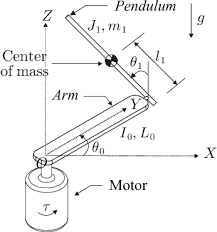

# Futura Pendulum Project

    Control System Design 482-01 
     
    <!--insert img-->
    by 
    Darniece Simon 
    Darren Bohler 
    Mathew Richards 
    Jovany Mondragon

    
    

    

   
    California State University, Chico Department of Mechanical and Mechatronic Engineering and 
    Advanced Manufacturing Chico, Ca 95929.

  
  
## Introduction
The Furuta pendulum has been in use since 1992, when it was invented by Katsuhisa Furuta. The Furuta pendulum, or the rotational inverted pendulum consists of a driven arm rotating in the horizontal plane. In the following report is the design, implementation, and analyzation through state space representation of the Furuta pendulum, Figure 1 provides a depiction of the analyzed. The system will become balanced in real time using an engineered simulation, which is connected through a state space representation equation

  
    
     
    Figure 1
    

## Objectives

- Produce a controller that balances a rotary inverted pendulum in its upright position starting from its downright position.
- When powered on the pendulum must stay upright (in the vertical axis). When the pendulum is knocked down or moved it must be able to return to its upright position by only using a motor that rotates in the horizontal axis.
- simulate the system in Coppelia while being connected to MATLAB
- Provide the mathematical model of the system
- If the system contains hardware, the design of hardware should consist the necessary architectural explanations such as hardware and software relationships.
## Modeling
The system consists of 2 masses, arm 1 m in the horizontal plane, and arm 2 the pendulum, which rotates freely in the vertical plane . In addition to a link connecting arm 1 and the pendulum, that is fixed. Figure 2 depicts a DC motor applying torque to arm 1 m, which moves horizontally then controlling the pendulum so it may remain in the upright position. The torque t is a critical component used in the feedback control system, which is done using a state-space model. The angular rotation from arm 1, 0is measured in the horizontal plane, where it is assumed that the counter clockwise direction is considered to be positive. The angular rotation from the pendulum 1is measured in the vertical plane, where it is also to be assumed that the counter clockwise direction is positive. The system is stable when the pendulum arm is hanging down in a stable position 1=0.

  
    
     
    Figure 2
    

### linear space model
When deriving the system dynamics assumptions must be considered. Firstly the motor and arm 1 are rigidly coupled and inelastic. In addition the coordinate axes of arms 1 and 2 are the principal axes of inertia. However, the motor rotor inertia is also assumed to be negligible, so the viscous damping is the only one to be considered.      
State-space equation is used as a mathematical model that represents the pendulum’s physical system. The pendulum system is represented by a set of inputs, outputs, and state variables related by first-order differential equations. Eq 1 and Eq 2 can be found below representing 

## Sensor Calibration

## Controller Design and Simulations (optional)

   
    

## Appendix A: Simulation Code

## References
Duart, J. L., et al. "Dynamic modeling and simulation of a rotational inverted pendulum." Journal of Physics: Conference Series. Vol. 792. No. 1. IOP Publishing, 2017. 

Lbeatu. “Lbeatu/Furuta-Pendulum-Simulink-Model-GUI-on-MATLAB-2017b.” GitHub, https://github.com/lbeatu/Furuta-Pendulum-Simulink-Model-GUI-on-MATLAB-2017b. 

Levis, Michel. “What Is Open Architecture?” Quanser, 11 Feb. 2020, www.quanser.com/blog/open-architecture-platforms-for-teaching-research/.  

pab47. “pab47/pab47.Github.io.” GitHub, 2020, https://github.com/pab47/pab47.github.io/tree/master/robotics/f20. 

“Regular API Reference.” Regular API Reference, Coppelia Robotics, https://coppeliarobotics.com/helpFiles/en/apiFunctions.htm.  

“Rotary Inverted Pendulum.” Quanser, 20 Apr. 2021, www.quanser.com/products/rotary-inverted-pendulum/#overview.  

“Rotary Pendulum Workbook Instructor Version.” Quanser, 2011, https://nps.edu/documents/105873337/0/Rotary+Pendulum+Workbook+_Instructor_.pdf/e17aa0a2-5f98-4957-b4a7-e80f0f52a4a3?t=1436282377000.  

“Rotary Servo Base Unit.” Quanser, 20 Apr. 2021, www.quanser.com/products/rotary-servo-base-unit/. 

